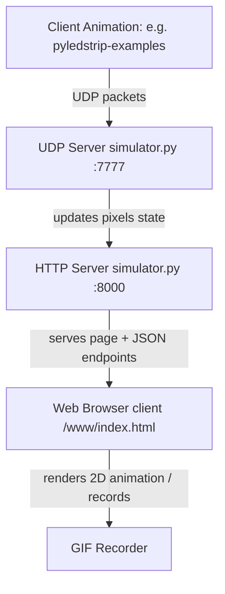

# pyledstrip-simulator

A UDP and HTTP-based software simulator for WS2812/WS2812b LED strips. It emulates a physical LED strip receiver, allowing you to develop and test animations using `pyledstrip` in a virtual environment without physical hardware.

## System Architecture



## Features

- **UDP Receiver Emulation**: Simulates a physical ESP8266/ESP32 running `pyledstrip` firmware by opening a UDP port (default `7777`) to acquire real-time color stream packets.
- **HTML5 Canvas Rendering**: Displays the LED strip animation in a web browser using a smooth, live-updating 2D canvas.
- **Custom Heightmaps / Layouts**: Renders the LEDs in spatial `x, y` coordinate positions loaded from a heightmap JSON file (e.g. simulating a spiral column, a matrix, or a custom rollercoaster shape).
- **GIF Recorder**: Capture the virtual LED animations directly from the web interface and export them to animated GIF files.
- **Auto Browser Launch**: Automatically opens the browser to the simulator UI upon startup.

---

## Installation & Setup

1. Clone this repository:
   ```bash
   git clone https://github.com/ledstrip/pyledstrip-simulator.git
   cd pyledstrip-simulator
   ```

2. Make sure you have python installed along with the `pyledstrip` package.

3. *(Optional)* If you want to use the GIF recording feature, ensure that `gif.js` and `gif.worker.js` are downloaded and placed into the `www/` directory.

---

## Usage

### 1. Start the Simulator

Start the simulator server:

```bash
python3 simulator.py [options]
```

#### Command Line Options
- `--led_port PORT`: UDP port to listen for incoming LED color data (default: `7777`).
- `--led_public`: Accept UDP data packets from any remote host, not just localhost (default: `False`).
- `--http_port PORT`: Port for the HTTP web server interface (default: `8000`).
- `--http_public`: Allow HTTP access from any remote host, not just localhost (default: `False`).
- `--heightmapfile FILE`: Path to the heightmap JSON mapping coordinates (default: `data/heightmap.default.json`).
- `--no_browser`: Do not auto-open the web browser on start (default: `False`).
- `--debug`: Print incoming packet size and sender debug information.

### 2. Stream Animations to the Simulator

With the simulator running (and browser window open at `http://127.0.0.1:8000`), run any script from `pyledstrip-examples` or other animations pointing to your local IP address:

```bash
python3 rainbow.py --host 127.0.0.1 --leds 300
```

---

## Web API Endpoints

The internal HTTP server exposes JSON endpoints which can be used by third-party visualization tools or for debugging:

- **`/data`**: Returns current state of pixels, data updates count, and sender address.
  ```json
  {
    "pixels": [[255, 0, 0], [0, 255, 0], [0, 0, 255]],
    "last_client": ["127.0.0.1", 54321],
    "data_updates": 1240
  }
  ```
- **`/map`**: Returns the array of coordinate positions loaded from the heightmap file.
  ```json
  {
    "map": [[0.0, 10.0], [1.0, 10.5], [2.0, 11.0]]
  }
  ```

---

## License

This project is licensed under the Mozilla Public License 2.0 (MPL-2.0). See the `LICENSE` file for details.
